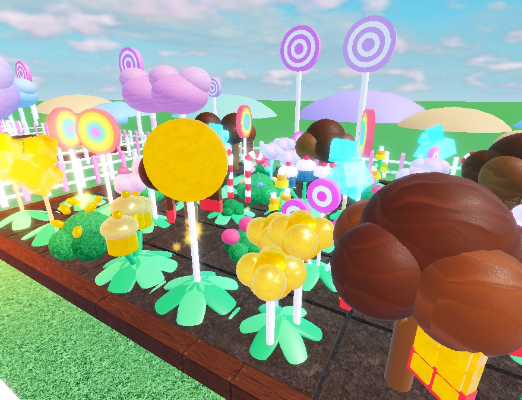

# Grow a Candy Garden

A "Grow a Garden"-style farming sim set in a pastel candy town. Buy seeds, plant them
in your own garden, harvest the candy, sell it at the market and grow rarer candy.
Server-wide weather adds mutations worth up to 50x.

## Loop
- **Your plot:** each player gets one of 6 fenced gardens, 8×6 tiles.
  - You start with 2 rows unlocked.
  - The other rows cost 400 / 4K / 40K / 400K; buy them at the golden stand.
- **Seed Shop** (left stall, or the Seeds button):
  - The stock rerolls for the **whole server** every 5 minutes.
  - Rare seeds often don't show up at all, so there's a reason to come back and a
    shared "a Rainbow Swirl is in stock!" moment.
- **10 candies**, from Gumdrop (10 coins, 20 s) up to Rock Candy Crystal (1.8M, 40 min).
  - Common seeds harvest once.
  - From Lollipop up, plants **regrow** after harvest.
  - Every candy rolls a weight (kg), and 3% are giants.
- **Harvest:** click ripe plants, or use the Collect button.
  - Candy goes into a basket that holds 120.
  - Sell it at the **Candy Market** (right stall, or the Sell button).
- **Weather:** a server-wide event every ~7 minutes.
  - Candies that ripen during weather can mutate:
    - Sprinkle Rain: Sugar-Coated, x2
    - Chocolate Storm: Choco-Dipped, x3
    - Ice Cream Blizzard: Frozen, x4
    - Rainbow Hour: grows faster, and Rainbow is 10x as likely
  - Golden (x20) and Rainbow (x50) can roll at any time.
- **Candy Index:** a silhouette for every candy, with 5 mutation dots each.
- **Retention:**
  - daily reward streak
  - tutorial tips for new players
  - leaderboards for total candy earned and the best single candy

## Money
Passes:
- 2x Sell (199)
- Fast Grow (249)
- Big Basket (99)
- VIP (149: +10% sell, a tag and a rainbow trail)

Products:
- Restock Seeds (29): restocks the shop for the whole server, which is social and
  impulse-friendly
- Grow Everything (49)
- Summon Weather (79): for the whole server

Item ids in `src/shared/Config.luau` are `0` until they're created on the Creator
Dashboard. Until then the shop shows them as "SOON". **Set the place's max players
to 6** (one plot each).

## Layout
- `src/shared/`: pure modules, also loaded by the Lune tests.
  - `Config`: seeds, rows, weather, mutations and items
  - `Rules`: growth, rolls, prices and formatting
  - `PlantModel`: plant and candy geometry for all 10 seeds, plus the mutation looks
- `src/server/World.luau`: builds the town from code.
  - candy street, both stalls, the chocolate fountain, lamps, trees and arches
  - plots, tiles, row unlocks
  - plant models
- `src/server/Main.server.luau`: sessions and saves (`CandyGarden_v1`), growth
  ticks, the server-wide shop and weather, actions, purchases, leaderboards.
  - In Studio it adds a `ServerStorage.Debug` BindableFunction:
    `Debug:Invoke(player, {coins = 1e6, rows = 6, plantAll = "cupcake", ripen = true, mutate = "golden", weather = "blizzard"})`.
    `plantMap` takes string keys (`{t1 = "lollipop"}`).
- `src/client/`:
  - `Main.client.luau`: HUD, the Seed Shop / Store / Index panels, the hotbar,
    click-and-drag planting, the hover card and the tutorial
  - `Juice.client.luau`: music, weather particles, tints and the rainbow, rainbow
    candy colour cycling, ripe flashes

## Testing
- `../../tools/check.sh candy-garden` runs the type check, lint, Lune tests and build.
- `tests/studio/loop.client.luau` needs a fresh save. It plants the 3 starter
  gumdrops through the real remotes, waits for them to ripen, harvests, sells and
  checks the Index.
- Marketing shots are in `marketing/`:
  - hero1: close-up of the garden
  - hero2: the town
  - hero3: Rainbow Hour
  - hero4: the Seed Shop
